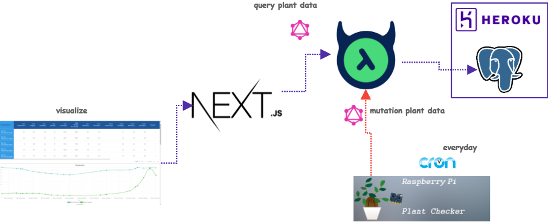

# [Plant Check Dashboard](https://plant-check-graph.vercel.app/)

> Let's visualize the environment of your plant by raspi_plant_checker.

## What's this?

The information obtained from [raspi_plant_checker](https://github.com/tubone24/raspi_plant_checker), a program that measures soil moisture and irradiance of plants using a combination of Raspberry Pi and sensors, is written to PostgreSQL on Heroku via GraphQL in Hasura Cloud,
and then written to a dashboard created with NextJS, Vercel, meterial-table, and chart.js. Vercel, meterial-table, and chart.js to read and display the information from Hasura Cloud's GraphQL.

## Architecture

